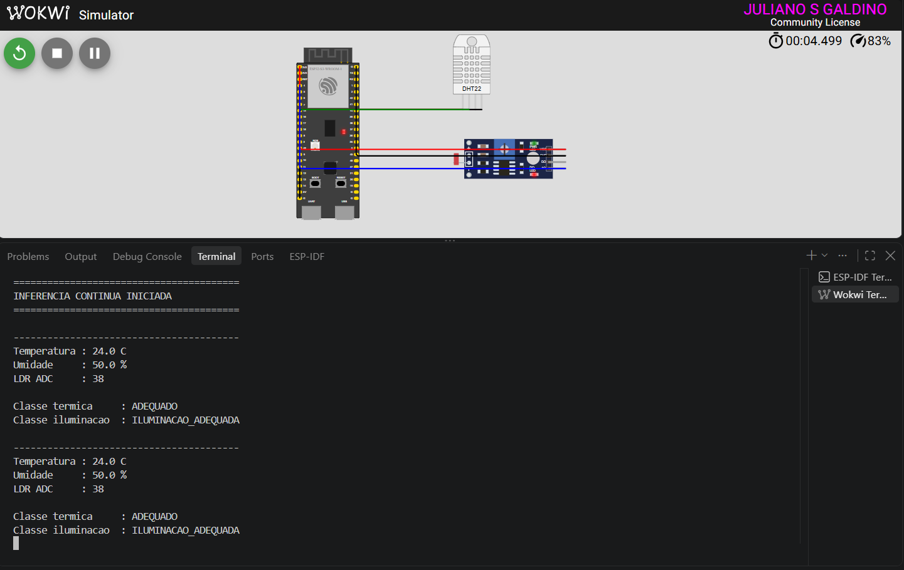
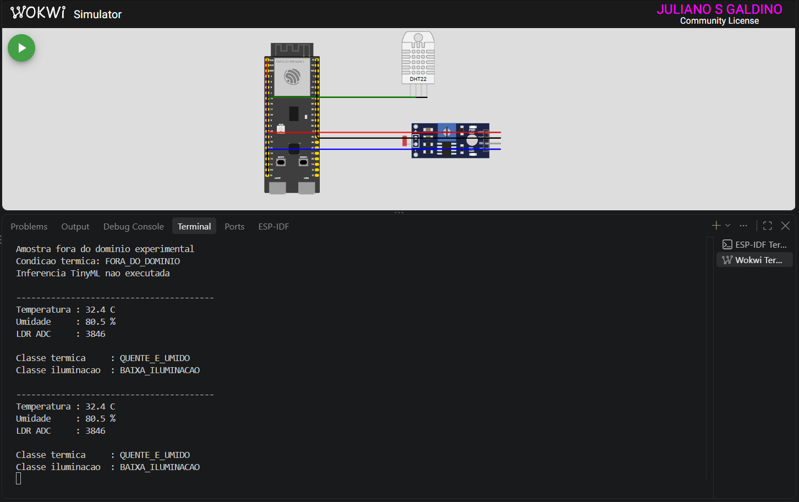

# Classificação de Condições Ambientais com TinyML no ESP32-S3

## Projeto Final

**Disciplina:** IA Embarcada e Modelos Compactos

## 1. Objetivo

Desenvolver uma aplicação de IA embarcada capaz de classificar condições ambientais a partir de dados de temperatura, umidade e luminosidade.

A inferência é executada localmente em um ESP32-S3 utilizando TensorFlow Lite Micro, sem necessidade de processamento externo para realizar a classificação.

O sistema utiliza duas saídas independentes:

- condição térmica;
- condição de iluminação.

---

## 2. Hardware e ambiente de simulação

O projeto utiliza:

- ESP32-S3 DevKitC-1;
- sensor DHT22;
- sensor LDR;
- ESP-IDF 6.1;
- TensorFlow Lite Micro;
- Wokwi para simulação.

### Ligações utilizadas

#### DHT22

- VCC → 3,3 V;
- GND → GND;
- DATA → GPIO 5.

#### LDR

- VCC → 3,3 V;
- GND → GND;
- saída analógica → GPIO 4.

No ESP32-S3, o GPIO 4 corresponde ao ADC1 Channel 3.

---

## 3. Entradas do modelo

O modelo utiliza três variáveis:

1. temperatura;
2. umidade;
3. luminosidade em valor ADC.

Antes da inferência, as entradas são normalizadas da mesma forma utilizada no treinamento:

```text
temperatura_normalizada = temperatura / 50
umidade_normalizada = umidade / 100
luminosidade_normalizada = ADC / 4095
```

Depois da normalização, os valores são quantizados para INT8 antes de serem enviados ao modelo embarcado.

---

## 4. Saídas do modelo

O modelo possui duas saídas independentes.

### 4.1 Condição térmica

- `ADEQUADO`
- `QUENTE_E_SECO`
- `QUENTE_E_UMIDO`

### 4.2 Condição de iluminação

- `ILUMINACAO_ADEQUADA`
- `BAIXA_ILUMINACAO`

A separação das saídas permite representar simultaneamente as condições térmica e de iluminação.

---

## 5. Critérios operacionais do experimento

Os critérios foram definidos para construção e avaliação experimental do modelo e não representam norma técnica de conforto ambiental.

### Condição térmica

| Classe | Temperatura | Umidade |
|---|---:|---:|
| `ADEQUADO` | 20 a 27 °C | 40 a 70% |
| `QUENTE_E_SECO` | 29 a 36 °C | 20 a 45% |
| `QUENTE_E_UMIDO` | 29 a 36 °C | 70 a 95% |

A faixa entre 27 e 29 °C foi tratada como região de transição.

### Condição de iluminação

| Classe | ADC |
|---|---:|
| `ILUMINACAO_ADEQUADA` | até 1800 |
| `BAIXA_ILUMINACAO` | a partir de 2200 |

A faixa entre 1800 e 2200 foi tratada como região de transição.

Nos testes realizados no Wokwi foi observado:

```text
mais luz  → menor valor ADC
menos luz → maior valor ADC
```

---

## 6. Dataset

O dataset experimental possui 60 amostras, distribuídas igualmente entre as seis combinações possíveis das três classes térmicas com as duas classes de iluminação.

| Condição térmica | Condição de iluminação | Amostras |
|---|---|---:|
| `ADEQUADO` | `ILUMINACAO_ADEQUADA` | 10 |
| `ADEQUADO` | `BAIXA_ILUMINACAO` | 10 |
| `QUENTE_E_SECO` | `ILUMINACAO_ADEQUADA` | 10 |
| `QUENTE_E_SECO` | `BAIXA_ILUMINACAO` | 10 |
| `QUENTE_E_UMIDO` | `ILUMINACAO_ADEQUADA` | 10 |
| `QUENTE_E_UMIDO` | `BAIXA_ILUMINACAO` | 10 |

Resultado da validação:

```text
Total de amostras: 60
Duplicatas exatas: 0
Erros encontrados: 0
RESULTADO: DATASET VALIDADO COM SUCESSO.
```

Arquivo:

```text
dataset/dataset_ambiente.csv
```

Script de validação:

```text
training/validar_dataset.py
```

---

## 7. Arquitetura do modelo

Foi utilizada uma rede neural do tipo MLP com:

- 3 entradas;
- Dense com 12 neurônios e ReLU;
- Dense com 8 neurônios e ReLU;
- saída térmica com 3 neurônios;
- saída de iluminação com 2 neurônios.

O modelo possui 197 parâmetros treináveis.

Representação simplificada:

```text
temperatura ─┐
umidade ─────┼──> Dense 12 ──> Dense 8 ──┬──> térmica: 3 classes
luminosidade ┘                             │
                                          └──> iluminação: 2 classes
```

---

## 8. Treinamento e avaliação

O dataset foi dividido de forma estratificada em:

- 36 amostras para treino;
- 12 amostras para validação;
- 12 amostras para teste.

Resultados no conjunto de teste:

```text
Acurácia térmica: 1.0000
Acurácia de iluminação: 1.0000
```

Matriz de confusão térmica:

```text
[[4 0 0]
 [0 4 0]
 [0 0 4]]
```

Matriz de confusão de iluminação:

```text
[[6 0]
 [0 6]]
```

Esses resultados correspondem ao conjunto de teste do experimento e não devem ser interpretados como garantia de generalização para condições não representadas no dataset.

Script de treinamento:

```text
training/treinar_modelo.py
```

---

## 9. Conversão e quantização

Após o treinamento, o modelo foi convertido para TensorFlow Lite em duas versões:

```text
modelo_ambiente_float.tflite : 3148 bytes
modelo_ambiente_int8.tflite  : 3584 bytes
```

A versão embarcada é:

```text
modelo_ambiente_int8.tflite
```

Foi aplicada quantização completa INT8 para adequar a execução ao microcontrolador.

Neste modelo muito pequeno, o arquivo INT8 ficou ligeiramente maior que o FLOAT devido ao overhead do formato quantizado. A quantização, portanto, foi utilizada principalmente para permitir execução eficiente com operações inteiras no ambiente embarcado, e não para reduzir o tamanho final do arquivo.

### Quantização da entrada

```text
shape: [1, 3]
scale: 0.0037664296105504036
zero_point: -128
```

### Saída de iluminação

```text
shape: [1, 2]
scale: 0.08659937232732773
zero_point: -36
```

### Saída térmica

```text
shape: [1, 3]
scale: 0.11728253960609436
zero_point: 29
```

O modelo TFLite INT8 foi novamente validado no conjunto de teste e manteve acurácia 1.0 nas duas saídas.

---

## 10. TensorFlow Lite Micro no ESP32-S3

O modelo INT8 foi incorporado ao firmware e executado com TensorFlow Lite Micro.

Durante a inicialização foram confirmados:

```text
TinyML inicializado com sucesso
Modelo INT8: 3584 bytes
Tensor Arena: 20480 bytes
```

O modelo utiliza apenas operadores `FULLY_CONNECTED`, registrados no `MicroMutableOpResolver`.

---

## 11. Pipeline de inferência

O fluxo executado no dispositivo é:

```text
DHT22 + LDR
     ↓
leitura dos sensores
     ↓
validação do domínio experimental
     ↓
normalização
     ↓
quantização INT8
     ↓
TensorFlow Lite Micro
     ↓
Invoke()
     ↓
classificação térmica
+
classificação de iluminação
```

A decisão das classes válidas é produzida pela rede neural. Regras determinísticas são utilizadas somente para impedir que entradas fora do domínio experimental sejam apresentadas como classificações válidas.

---

## 12. Teste controlado

Antes da inferência contínua, o firmware executa uma amostra conhecida:

```text
Temperatura: 36.0 °C
Umidade: 95.0 %
LDR ADC: 4046
```

Resultado:

```text
Classe termica: QUENTE_E_UMIDO
Classe iluminacao: BAIXA_ILUMINACAO
RESULTADO: TESTE TINYML APROVADO
```

---

## 13. Validação no Wokwi

As seis combinações experimentais foram testadas durante a inferência contínua:

| Teste | Temperatura | Umidade | ADC | Classe térmica | Classe de iluminação |
|---|---:|---:|---:|---|---|
| 1/6 | 36.0 °C | 95% | 3969 | `QUENTE_E_UMIDO` | `BAIXA_ILUMINACAO` |
| 2/6 | 36.0 °C | 95% | 1407 | `QUENTE_E_UMIDO` | `ILUMINACAO_ADEQUADA` |
| 3/6 | 33.0 °C | 30% | 1407 | `QUENTE_E_SECO` | `ILUMINACAO_ADEQUADA` |
| 4/6 | 33.0 °C | 30% | 3295–4058 | `QUENTE_E_SECO` | `BAIXA_ILUMINACAO` |
| 5/6 | 24.0 °C | 50% | 3295 | `ADEQUADO` | `BAIXA_ILUMINACAO` |
| 6/6 | 24.0 °C | 50% | 1074 ou inferior | `ADEQUADO` | `ILUMINACAO_ADEQUADA` |

Todas as seis combinações foram classificadas corretamente durante os testes.

### Evidências





---

## 14. Condições fora do domínio

O firmware verifica se a leitura pertence ao domínio experimental utilizado na construção do dataset.

Exemplo:

```text
Temperatura : 19.7 C
Umidade     : 66.5 %
LDR ADC     : 3969
```

Resultado:

```text
Amostra fora do dominio experimental
Condicao termica: FORA_DO_DOMINIO
Inferencia TinyML nao executada
```

A faixa de iluminação entre ADC 1800 e 2200 também é identificada como zona de transição.

---

## 15. Estrutura do projeto

```text
tinyml_ambiente/
├── dataset/
│   └── dataset_ambiente.csv
├── docs/
│   ├── 01_especificacao.md
│   ├── 02_decisoes.md
│   ├── 03_dataset.md
│   └── 04_resultados.md
├── evidencias/
│   ├── 01_validacao_inferencia.md
│   ├── 02_log_teste_controlado_fora_dominio.txt
│   └── imagens/
├── firmware/
│   └── ambiente_sensores/
├── model/
│   ├── historico_treinamento.csv
│   ├── metricas_modelo.txt
│   ├── modelo_ambiente.keras
│   ├── modelo_ambiente_float.tflite
│   └── modelo_ambiente_int8.tflite
├── training/
│   ├── treinar_modelo.py
│   └── validar_dataset.py
├── .gitignore
└── README.md
```

---

## 16. Principais arquivos

| Finalidade | Arquivo |
|---|---|
| Dataset | `dataset/dataset_ambiente.csv` |
| Validação do dataset | `training/validar_dataset.py` |
| Treinamento e conversão | `training/treinar_modelo.py` |
| Modelo INT8 | `model/modelo_ambiente_int8.tflite` |
| Firmware | `firmware/ambiente_sensores/main/ambiente_sensores.cpp` |
| Resultados | `docs/04_resultados.md` |
| Evidências | `evidencias/` |

---

## 17. Limitações

- O dataset possui finalidade experimental.
- As 60 amostras foram produzidas em ambiente simulado e controlado.
- Os critérios adotados não representam norma técnica de conforto ambiental.
- Os resultados do conjunto de teste não garantem generalização para ambientes reais ou entradas fora das regiões utilizadas na construção do dataset.

---

## 18. Resultado final

O projeto implementa o fluxo completo de uma aplicação TinyML:

```text
coleta de dados
→ construção e validação do dataset
→ treinamento
→ avaliação
→ conversão para TensorFlow Lite
→ quantização INT8
→ incorporação do modelo ao firmware
→ execução no ESP32-S3
→ inferência contínua com sensores
```

O modelo é executado localmente no ESP32-S3 e produz duas classificações independentes a partir das leituras de temperatura, umidade e luminosidade.

Os testes realizados no Wokwi confirmaram o funcionamento das seis combinações experimentais previstas no projeto.
